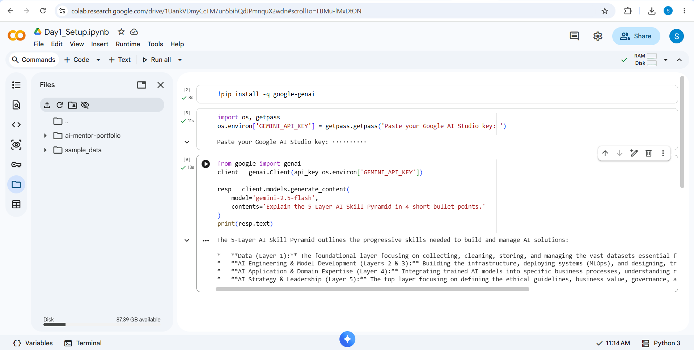
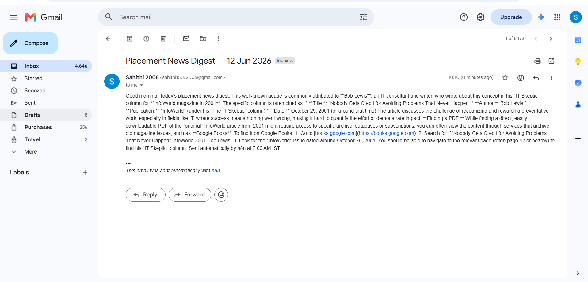

```markdown
# AI Mentor Bootcamp — <Doddi Sahithi>

Public portfolio of 12-day AI Trainer Workshop. By Day 12: 6 daily notebooks + capstone Streamlit URL.
```
## Day 1 — Setup complete

- ✅ Google AI Studio API key provisioned
- ✅ Groq API key provisioned
- ✅ Hello-Gemini call working — see [Day1_Setup.ipynb](Day1_Setup.ipynb)
- 4-tool comparison matrix from Lab 1A: see screenshot below



## Day 2 Lab 2B — Errors handled

1. **Markdown fence wrapping** (`\`\`\`json ... \`\`\``)
   The retry prompt asks Gemini to output raw JSON without fences. Triggers on ~5-10% of calls.

2. **Hallucinated phone number when source has none**
   `Optional[str] = None` in Pydantic — model returns `null`, schema validates.

3. **Empty / whitespace-only input**
   Pydantic raises ValidationError with "Field required". Caller catches.

## Sample résumés processed: 3 / 3 successful

## Day 4 — n8n Daily News Digest

- ✅ Self-hosted n8n via Docker
- ✅ Workflow: Schedule (7AM IST) → RSS → Gemini summariser → Gmail
- ✅ Workflow JSON committed: [Day4_NewsDigest.json](Day4_NewsDigest.json)
- ✅ Test email screenshot below



## Day 5 — Résumé Scorer Streamlit

**Live URL:** https://ai-mentor-portfolio-jxueduptxclnmfrkdegwee.streamlit.app

### Features

* Fit score with rationale
* Score breakdown chart
* Missing skills detection
* Learning resources recommendations

### Tools Used

* Streamlit
* Gemini 2.5 Flash
* Continue.dev

### Reflection

* Continue.dev helped scaffold the application quickly.
* I reviewed and understood each accepted code suggestion.
* Deployment taught me how to securely manage API keys using Streamlit Secrets.
